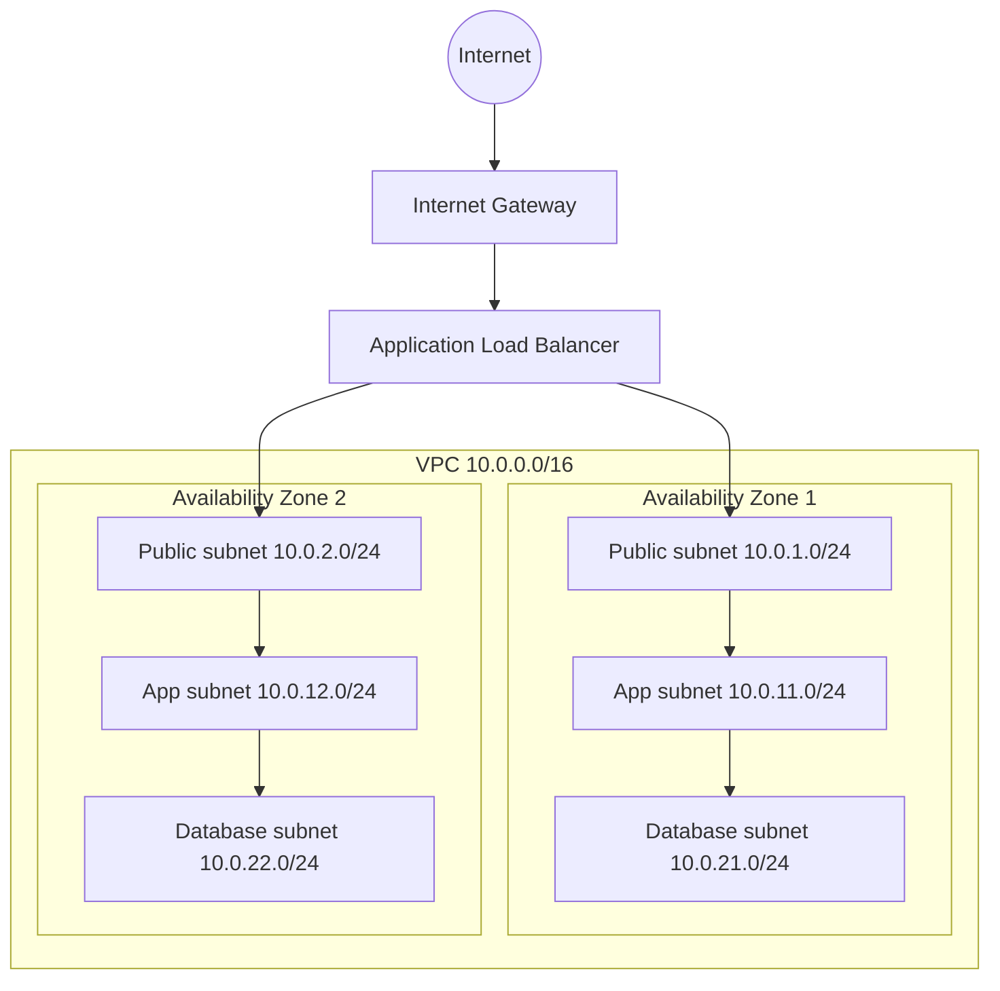
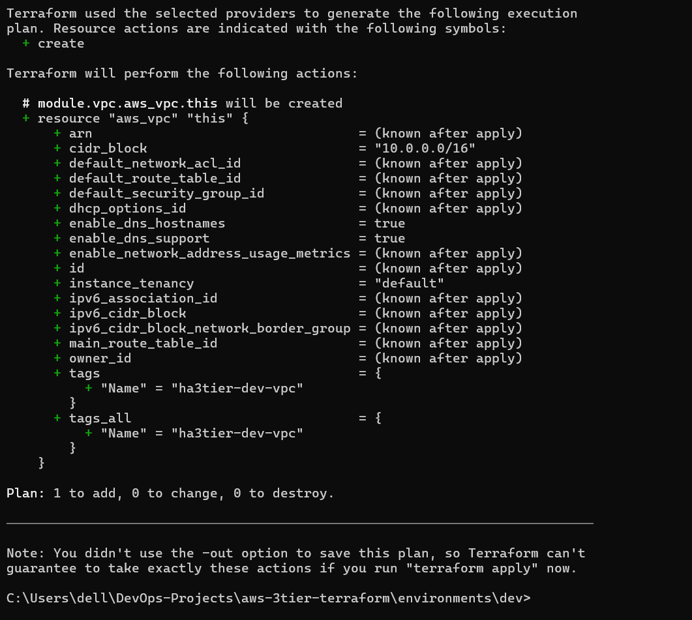
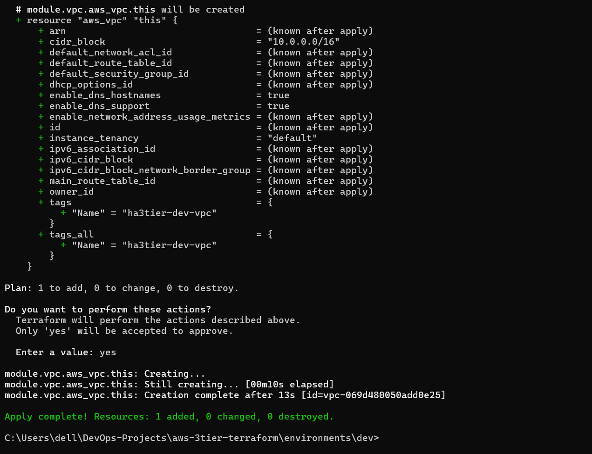
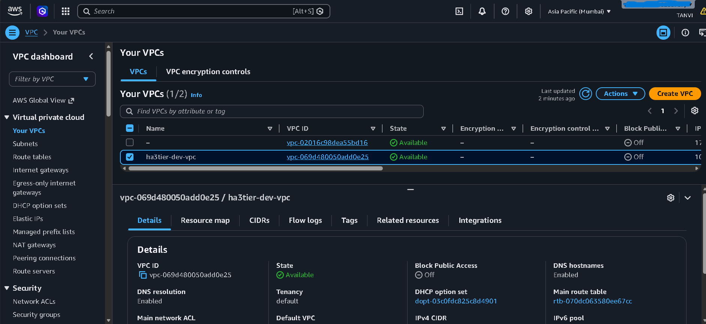
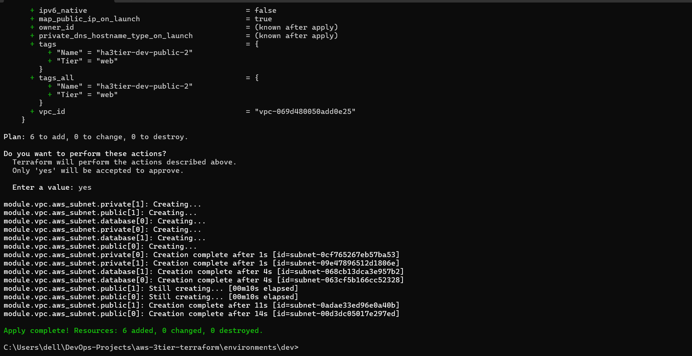
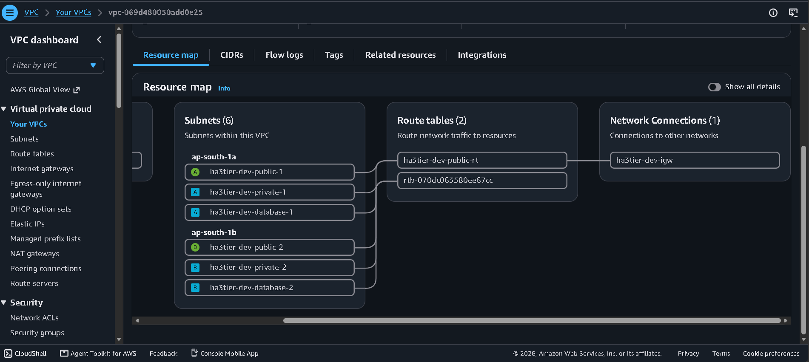
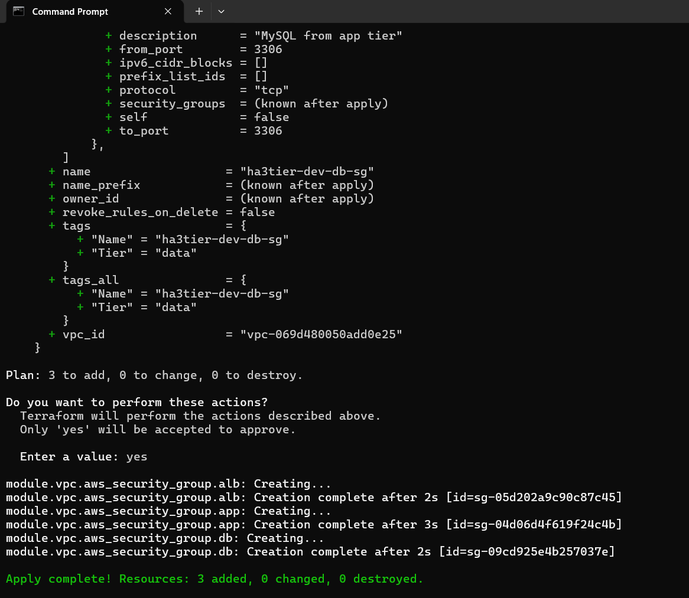
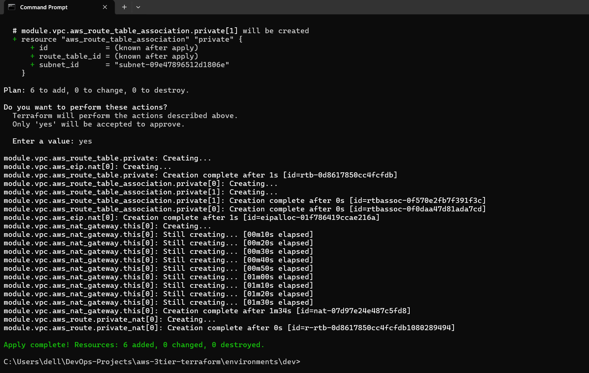

# AWS Highly Available 3-Tier Architecture with Terraform

This project builds a highly available three-tier network on AWS using Terraform. I am building it step by step, one layer at a time, and committing after each working stage. The goal is to practise designing infrastructure as code the way production teams do, while staying inside the AWS free tier.

Current status: in progress. The networking and security layers are complete. The load balancer, compute, database and monitoring layers are next.

## Goals

- Define all infrastructure as code, with nothing created by hand in the console
- Spread every tier across two Availability Zones so one failure does not take the application down
- Keep the database isolated from the internet
- Use reusable Terraform modules so the same code can serve more than one environment
- Keep costs close to zero, and be able to destroy and recreate everything safely

## Architecture



This is the target design. The load balancer, application servers and database are not built yet.

| Tier | Subnets | Purpose | Internet access |
|---|---|---|---|
| Web | Public, two AZs | Load balancer | Directly, through the internet gateway |
| Application | Private, two AZs | Application servers | Only through the load balancer |
| Data | Private, two AZs | Database | None |

## Security design

Each tier has its own security group, and each one only accepts traffic from the tier above it.

| Security group | Accepts traffic from | Port |
|---|---|---|
| ALB | The internet | 80 |
| Application | The ALB security group only | 80 |
| Database | The application security group only | 3306 |

The database group has no outbound rule, because the database has no reason to start connections to the internet. Terraform runs as a dedicated IAM user rather than the root account, and a monthly AWS budget alert protects against unexpected charges.

## What is built so far

- VPC with DNS support enabled
- Six subnets across two Availability Zones (web, application and database tiers)
- Internet gateway and a public route table associated with the public subnets
- Three security groups with tier-to-tier rules
- Single NAT gateway behind a variable, so it can be switched off to save cost

## What is next

- Application Load Balancer and Auto Scaling Group
- Multi-AZ RDS database in the database subnets, with a failover test
- GitHub Actions pipeline running format, validate and plan checks
- CloudWatch dashboards and alarms

## Screenshots

VPC creation





VPC created in AWS



Six subnets across two Availability Zones



Resource map showing the VPC, subnets, route table and internet gateway



Security groups, with the database group accepting traffic only from the application group



NAT gateway giving private subnets outbound internet access


## Repository layout

```
environments/
  dev/            provider configuration and module calls
modules/
  vpc/            VPC, subnets, internet gateway, route tables, security groups
docs/
  screenshots/    screenshots of the deployed resources
```

## How to run it

Requirements: Terraform 1.5 or later, and the AWS CLI configured with an IAM user that has permission to manage VPC and EC2 resources.

```
cd environments/dev
terraform init
terraform plan
terraform apply
```

To remove everything and avoid charges:

```
terraform destroy
```

## What I learned so far

- Terraform only reads the files in the folder you run it from, so project layout matters.
- A subnet is only public when it has a route to an internet gateway. The name alone does nothing.
- Security groups can reference other security groups, which makes tier-to-tier rules cleaner than using IP ranges.
- Terraform state files can contain sensitive data and must never be committed.

## Author

Tanvi
GitHub: https://github.com/Tanvi-s26